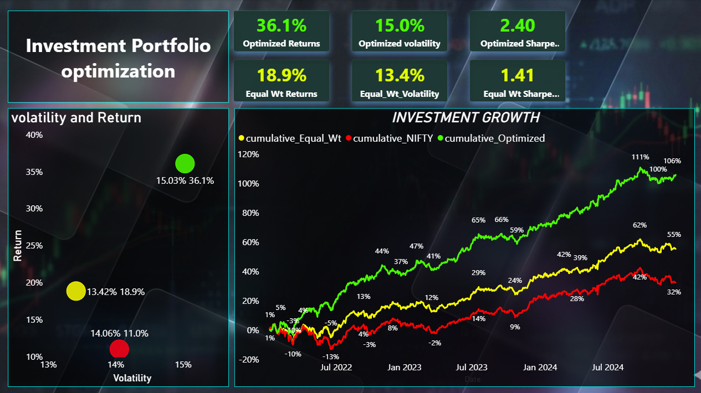
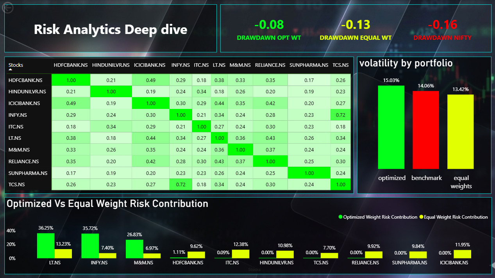
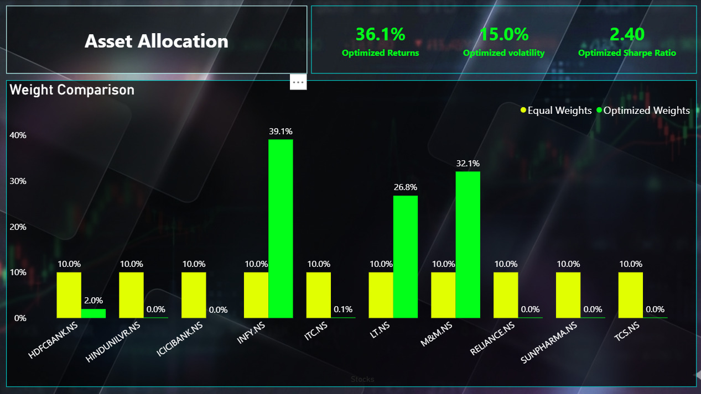

# 📊 Portfolio Risk Optimization & Performance Analytics  
### 10 NSE Stocks | 3-Year Market Study | Python + Power BI

---

## 🚀 Project Summary

This project applies **Modern Portfolio Theory (MPT)** to construct and optimize a 10-stock NSE portfolio using 3 years of historical market data.

The study compares:

- Equal-Weight Portfolio  
- Sharpe Ratio Optimized Portfolio  
- NIFTY 50 Benchmark  

The objective is to determine whether **data-driven optimization improves risk-adjusted performance** over traditional allocation.

---

# 📊 Dashboard Preview

---

## 🔹 Investment Growth Comparison

Shows:
- Cumulative Returns  
- Optimized vs Equal vs NIFTY  
- Risk–Return Positioning

---

## 🔹 Risk Analytics Deep Dive

Includes:
- Correlation Heatmap  
- Portfolio Drawdown  
- Volatility Comparison  
- Risk Contribution Analysis  

---

## 🔹 Asset Allocation & Optimization

**Key Highlights:**
- Return: 36.1%
- Volatility: 15.0%
- Sharpe Ratio: 2.40
- Weight Comparison (Equal vs Optimized)  

---

## 🎯 Business Objective

Traditional allocation methods ignore:

- Asset correlation  
- Risk concentration  
- Downside exposure  
- Risk-adjusted efficiency  

This project builds a **quantitative optimization framework** to maximize return per unit of risk.

---

## 🧠 Methodology

### 1️⃣ Data Preparation
- Download daily adjusted close prices  
- Align trading dates  
- Compute daily returns  

### 2️⃣ Risk & Return Metrics
- Annualized Returns  
- Annualized Volatility  
- Covariance Matrix  
- Correlation Matrix  

### 3️⃣ Portfolio Construction

**Equal Weight**
- 10% per stock  

**Optimized Portfolio**
- Objective: Maximize Sharpe Ratio  
- Constraints:
  - Σ Weights = 1  
  - No Short Selling  

### 4️⃣ Performance Evaluation
- Cumulative Returns  
- Sharpe Ratio  
- Maximum Drawdown  
- Risk Contribution  
- Benchmark Comparison  

---

## 📊 Results Snapshot

| Metric | Optimized | Equal Weight | NIFTY 50 |
|--------|-----------|--------------|----------|
| Annual Return | 36.1% | 18.9% | — |
| Volatility | 15.0% | 13.4% | 14.0% |
| Sharpe Ratio | 2.40 | 1.41 | — |
| Max Drawdown | -8% | -13% | -16% |

### 📌 Key Insight
Sharpe optimization significantly improved **risk-adjusted performance** and reduced downside exposure.

---

## 🛠 Tech Stack

- Python (NumPy, Pandas, SciPy, yFinance)
- Power BI (Interactive Dashboard)
- Excel (Validation)
- GitHub (Version Control)

---

## 📂 Repository Structure
 - Data_analysis file 
 - exported excel (not needed, Jupyter file itself outputs excel)
 - power bi dashboard
 - investment growth image
 - risk analytics image
 - asset allocation image
---

## 🔬 Research Hypotheses

- H1: Optimized portfolio delivers superior risk-adjusted returns.  
- H2: Diversification reduces portfolio volatility.  
- H3: Risk-adjusted metrics outperform raw return comparison.

---

## 🔮 Future Enhancements

- Efficient Frontier Simulation  
- Monte Carlo Stress Testing  
- Rolling Sharpe Analysis  
- Transaction Cost Modelling  
- Dynamic Rebalancing  

---

## 👤 Author - Shreyas Auti 
 - +918080079215
 - shreyas.9auti@gmail.com
 - https://www.linkedin.com/in/shreyas-auti-301a21175

